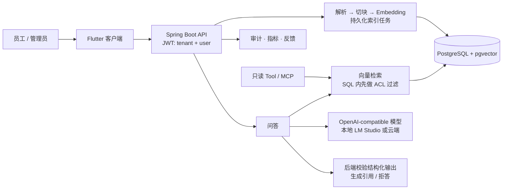

# Enterprise RAG Knowledge Base — 作品集说明

> **English summary.** An enterprise knowledge-base Q&A system (Spring Boot, PostgreSQL + pgvector, Flutter). Employees retrieve only documents they are allowed to see, every answer cites its sources, and uncovered questions are handed off instead of invented. The project includes evaluation, audit, and deployment runbooks. It was built with AI coding agents (Codex, Claude Code), with scope, architecture, evaluation, review, and acceptance owned by me. Full write-up: [docs/CASE_STUDY_EN.md](docs/CASE_STUDY_EN.md).
>
> 本文件只写有证据的内容，证据以 [PROGRESS.md](PROGRESS.md) 与 [evaluation/reports/](evaluation/reports/README.md) 为准。最后更新：2026-09-24。

## 快速入口

| 你想… | 去这里 |
|---|---|
| 5 分钟在本机跑起来 | [README Quick Start](README.md#quick-start)（已在全新 clone 上逐字验证） |
| 看演示 | 演示视频制作中（ROADMAP A5）；可执行讲稿见 [docs/DEMO.md](docs/DEMO.md) |
| 看架构和权限边界 | [docs/ARCHITECTURE.md](docs/ARCHITECTURE.md) |
| 看评测方法和结果 | 下文「评测结果与已知局限」、[evaluation/README.md](evaluation/README.md) |
| 看项目复盘 | [中文 Case Study](docs/CASE_STUDY.md) / [English](docs/CASE_STUDY_EN.md) |

## 解决的问题

企业把制度、产品手册、售后 FAQ 放进 AI 问答之后，会马上遇到这些问题：

- 员工 A 不该看到财务制度，怎么保证 AI 不会“说漏嘴”？
- 答案来自哪份文件的哪一段？模型会不会编造引用？
- 资料里没有的问题，AI 会不会凭常识乱答？
- 文档更新失败、模型服务宕机时，系统会怎样？
- 答得好不好、快不快、贵不贵，拿什么衡量？

这个项目针对这些问题给出了一条完整、可运行的实现。

## 架构

## 三个关键设计决策

**1. 权限是检索条件，不是界面过滤。**
租户、部门、角色、知识库成员和文档 ACL 都在 SQL 的向量检索语句里过滤。未授权的内容不会进入模型上下文，所以模型没有机会“说漏嘴”。授权→可答、撤权→拒答，这两条都有 PostgreSQL 集成测试（撤权后模型根本不会被调用），也在全新 clone 上用 curl 实测过。

**2. 引用由后端生成，出错一律转人工（fail-closed）。**
模型只能返回 `answer`、`found`、`grounded` 和片段编号（JSON Schema 约束）。文件名、定位和原文片段由后端根据检索结果映射。遇到以下情况，统一返回稳定的失败原因并转人工，不会给出一个“看起来像”的答案：非法 JSON、引用编号越界、模型自称资料不足却标 `found=true`、输出被截断、模型服务超时。

**3. 用评测决定改不改，而不是凭感觉加组件。**
每个检索方案都在同一套版本化数据集和固定配置下对比：Keyword-RRF、多样性重排、相邻块、多种切块大小、按标题切块。结果都没有稳定胜过默认方案，所以默认值一个也没改，结论和反例都保留在报告里。这比“上了 Hybrid Search 和 Reranker”更能说明问题，详见下文。

## 已实现能力

- **文档**：PDF / DOCX / TXT / Markdown 上传；checksum 幂等；版本化替换；停用、启用、软删除、重建索引。
- **索引**：持久化任务队列，支持幂等入队、自动重试 3 次、管理员人工重试、进程重启后恢复。重建或替换失败时，旧版本继续提供服务。
- **身份与权限**：JWT 携带 tenant 和 user；用户、部门、角色、知识库成员、文档 ACL 均可按 USER / DEPARTMENT / ROLE 授权；越权访问统一返回 404 并记录拒绝审计；权限变更（文档 ACL、知识库成员、用户角色的授予与撤销）记录谁在何时改了什么，且与变更本身在同一事务提交。
- **问答**：pgvector Top-K 检索，相似度过低时直接拒答；返回结构化答案、后端引用、requestId、分段耗时、Token 用量和失败分类。
- **运营**：审计查询、受保护的检索诊断、Prometheus 指标（含估算成本）、健康和就绪探针、用户反馈。
- **Agent 边界**：3 个只读 Tool 和一个无状态 MCP 适配层，复用同一套身份、ACL、调用预算和审计。
- **客户端**：Flutter 问答（答案卡、引用弹窗、反馈），知识库管理，文档 ACL 管理，索引任务面板。
- **交付**：Docker Compose、部署与故障 Runbook、备份恢复演练、Discovery Brief、演示讲稿。

## 评测结果与已知局限

这是 V0.1 的质量声明。质量门继续跟踪，但不阻塞 V0.1 交付。

配置：本地 LM Studio（Gemma 4 26B，关闭 Thinking）+ nomic-embed-text-v1.5，VECTOR 检索，Top-K=5，切块 700/100。语料是 7 份合成文档。数据来自 2026-09-24 同一配置下的两次会话。

| 数据集 | 结果 | 说明 |
|---|---|---|
| answer-quality-v1（12 题，rubric-v2） | 每轮 8–10/12，**未通过质量门**（门槛：连续 3 轮都 ≥10/12） | 稳定失败的是 Q002、Q006：FAQ 的一个 chunk 混合了 4 个章节，导致这两题召回不到 |
| golden-v1（20 题） | 17/20、15/20 | 两次会话之间有 ±2 的波动 |
| retrieval-stress-v1（8 题） | 8/8、8/8 | 覆盖多文档、长文档和拒答题 |
| ACL 泄漏 | 0 | 所有运行均为 0 |
| 结构化输出 | 1 次后端 fail-closed，其余全部通过 | 失败按设计转人工 |
| 本地性能 | 单次问答约 1.5–3.5 秒，约 1,600 tokens | 本地单机测量，不是 SLA |
| **云端对照：DeepSeek flash + 本地 Embedding**（2026-09-26） | answer-quality 10/10/10，**通过质量门**；golden 17/20；stress 8/8；中位延迟 1.0–1.6 秒；约 1,650 tokens/题 | 剩下的失败全部是检索导致的（Q002/Q006 等）；本地 Gemma 偶尔漏答的 Q001 在这里全部通过。按官方价格估算，每千次问答约 $0.25–2，实际接近下限。见 [云端对照报告](evaluation/reports/cloud-provider-deepseek-local-2026-09-26.md) |

从评测里学到的：

- 把切块改成 300/60 可以修好 Q002/Q006，并通过 answer-quality 门槛；但 golden 掉到 14/20、stress 掉到 7/8，综合持平，所以没有采用。按标题切块在离线复放阶段就被否决了。详见 [切块 A/B](evaluation/reports/chunking-ab-local-2026-09-24.md) 与 [离线复放](evaluation/reports/heading-chunking-offline-replay-local-2026-09-24.md)。
- 在 7 份文档的语料上，Top-5 已经覆盖一半以上的 chunk，继续调检索低于噪声水平。下一步（ROADMAP 阶段 B）换成真实规模的公开语料和约 50 道题，再比较多语言 Embedding 和云端模型的质量、延迟和成本。

其他已知局限：

- 没有生产部署、公开 Demo 或真实客户运营数据；所有数字都来自本地合成数据。
- “兼容 OpenAI 接口”并不代表结构化输出也兼容：DeepSeek 不支持 `json_schema`，已增加 `AI_RESPONSE_FORMAT=json_object` 选项，后端校验不变。
- 本地 LM Studio 会把部分模型输入输出写入本机日志，只能用于合成或公开数据。真实数据必须换用通过 [Provider 验收清单](docs/DEPLOYMENT_RUNBOOK.md) 的服务。
- ACL 只支持 allow 规则，没有显式 deny 和权限缓存失效策略。chunk 没有记录生成它的 Embedding 模型，更换模型时需要全量重建。
- MCP 只做了只读的最小适配，没有完整的 SDK 互操作验证、模型驱动的 Agent 循环或写操作。

## 工程证据

- 后端 126 个测试（含 Testcontainers 上的 PostgreSQL/pgvector 集成测试），GitHub Actions CI 通过。
- 从全新 clone 按 README 跑通：启动、上传、问答、拒答、授权与撤权、故障重试。演练中发现 8 处文档缺口和 1 个真实缺陷（重建失败会让文档下线），当天全部修复。见 [演练报告](evaluation/reports/clean-clone-rehearsal-local-2026-09-24.md)。
- 本地备份恢复演练，MCP 只读冒烟检查 16/16，Android 16 真机完成管理员 ACL 和索引任务的验收。

## 如果你是客户

可交付的形态：**团队或企业内部知识库问答 MVP**。

- **包含**：文档接入（PDF/Word/Markdown）；按部门或角色的查看权限；带出处的回答；资料外问题转人工；管理端（上传、权限、索引状态）；部署文档与交接。
- **可选**：本地模型（数据不出内网），或云端模型。已实测 DeepSeek flash：在同一评测集上质量高于本地模型，中位延迟约 1–1.6 秒，按官方价格估算每千次问答不到 $1，Embedding 仍在本地。
- **不承诺**：AI 百分之百正确。系统设计为资料不足时拒答并转人工，准确率需要用客户自己的文档和问题来评测。

## 开发方式

实现代码主要由 AI 编码代理（OpenAI Codex、Claude Code）编写。本人负责需求与范围、架构取舍、评测设计、代码评审、验收与发布决策。

## 边界

这是一个在本地合成数据上可复现的企业 RAG 项目，不是生产部署，也不包含 ROI 结论。技术栈：Java 17 / Spring Boot 3.5、PostgreSQL 16 + pgvector、Flutter（Riverpod），评测工具用 Python。
