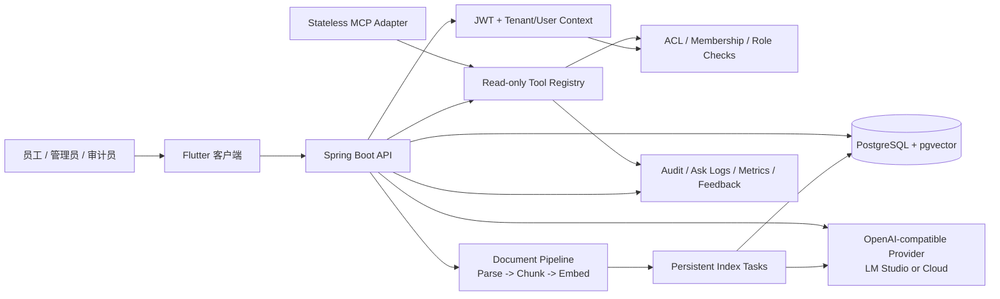
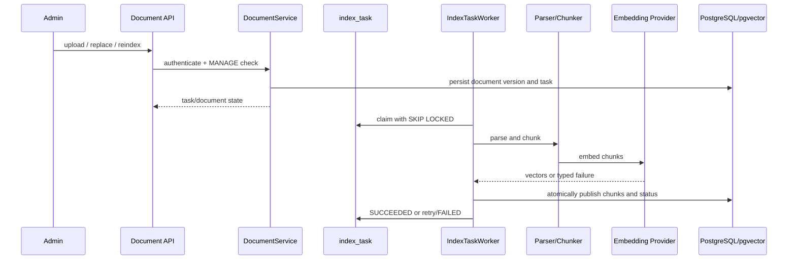
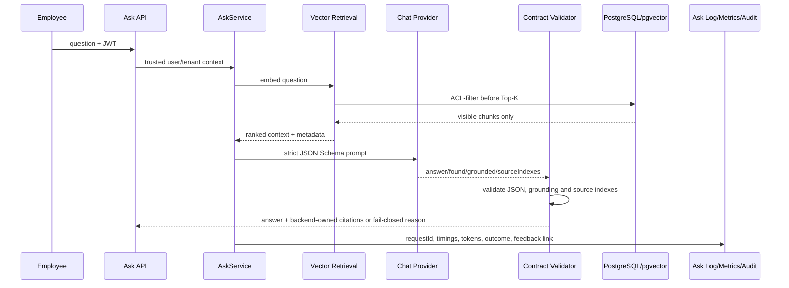

# 企业知识库 V0.1 架构说明

> 文档日期：2026-09-22
> 范围：当前仓库已经实现或有验证证据的能力。规划中的能力不会画成已上线组件。

## 1. 系统上下文

## 2. 两条核心数据流

### 文档入库与索引

任务以 `documentId:contentVersion` 作为幂等边界，支持有限自动重试、人工重试和进程重启恢复。替换文档只有在新版本索引成功后才切换可检索内容。

### 问答与引用

默认路径是 `VECTOR`、Top-K=5、相似度阈值 0.35、Structured Output 重试 1 次。Hybrid Search、vector-diversity、复杂问题预算路由都保持实验开关关闭。

## 3. 权限与信任边界

| 边界 | 规则 |
|---|---|
| 客户端 -> API | 客户端只提供登录凭证、问题和展示参数；客户端过滤不作为安全边界 |
| JWT -> 服务端 | `userId` 和 `tenantId` 从认证主体取得，不接受模型或工具参数覆盖 |
| 检索 -> 数据库 | tenant、用户、部门、角色、知识库 membership 和 document ACL 在查询阶段过滤 |
| 模型 -> 引用 | 模型只返回 `sourceIndexes`；最终 filename、locator、snippet 由后端检索结果映射 |
| Tool/MCP -> Registry | 只暴露三个只读工具，闭合参数 Schema，单批最多三次调用，继续复用 ACL 和审计 |
| 运营观测 | 普通用户不读取指标和检索诊断；管理员/审计员读取受保护的低敏元数据 |
| Provider 日志 | 应用不记录 Prompt/正文，但 Provider 自身可能记录请求；上线前必须单独审查其日志策略 |

当前 MCP 是无状态、受限的 `POST /mcp` 适配层，仅支持 `server/discover`、`tools/list` 和 `tools/call`。Sessions、Tasks、Resources、Prompts、OAuth metadata、模型驱动循环和写工具不在当前边界内。

## 4. 数据职责

| 数据域 | 主要职责 | 当前底座 |
|---|---|---|
| Identity | tenant、用户、部门、角色 | PostgreSQL + JWT |
| Knowledge | 知识库、membership、文档、ACL、版本 | PostgreSQL |
| Retrieval | Chunk、Embedding、Top-K 结果 | PostgreSQL + pgvector |
| Operations | index task、ask log、audit event、feedback | PostgreSQL |
| Files | 原始上传文件 | 配置的本地存储目录；生产需持久化卷/对象存储策略 |
| AI | Chat 与 Embedding | OpenAI-compatible Provider |

## 5. 关键设计决定

1. Java/Spring Boot 保留企业 API、事务、权限、审计和部署主线；Python 只承担评测和实验脚本。
2. PostgreSQL 同时承载业务、权限、审计和向量，先用一个可解释的企业数据边界完成 V0.1。
3. 先让检索结果可解释、引用可校验，再考虑 Hybrid Search 或 Reranker。
4. 失败必须可分类、可观测、可重试；不能用宽松 JSON 解析掩盖 Provider 失败。
5. 任何 Agent 写操作都需要审批、幂等、审计、回滚和最小权限设计，当前明确关闭。

## 6. 不属于当前架构的内容

Fine-tuning、GraphRAG/Neo4j、复杂 Multi-Agent、Kubernetes、多地域高可用、本地 GPU 和全量 Python 重写均不属于当前 V0.1 验收条件。
